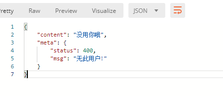
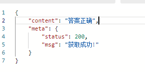
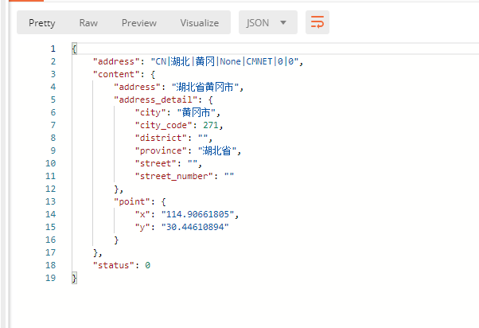
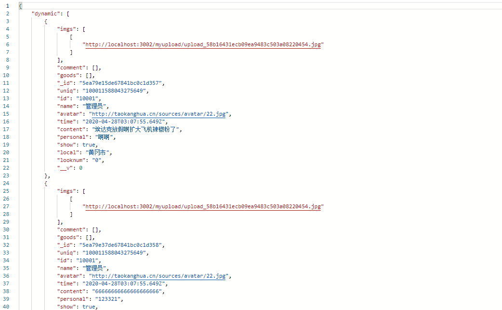

# 登陆

## 注册接口

`http://localhost:3005/loginup`

> method: POST
>
> Body: x-www-form-urlencoded

`新增local  需要在请求添加local：{}`

```javascript
{
    password: String  //账户密码 必填
    question: String //密保问题 必填
    answer: String // 密保答案 必填
}
```

返回参数如下：


数据库数据如下：


## 登陆接口

`http://localhost:3005/loginin`

> method: POST
>
> Body: x-www-form-urlencoded

```js
{
    account: String //用户id
    password: String //用户密码
}
```

登陆成功:


密码错误:


查无此人:


## 获取某个用户密保问题

`http://localhost:3005/question/:id`

> method: GET
>
> 参数说明:
>
> ​			id: 用户id

成功效果:


失败:



## 验证密保问题是否正确

`/question/answer`

> method: POST,
>
> Body: x-www-form-urlencoded

发送

```js
{
    account: string
    answer: string
}
```


成功返回:



失败回调:


## 修改密码接口

`/question/changepwd`

> method: POST

表单参数:

```js
{
    account:string,
    password:string
}
```

成功:


失败我不知道怎么实现  估计网络会导致

# 主页操作

## 获取所有用户列表

`/allusers`

> method: GET

`返回里面还有一个 img属性 用户头像`

成功：


## 更新用户信息接口

`/updatedata`

> method: POST

```js
//请求参数
{
    account: string,
    nickname:string, //昵称
    gender:string,
    borndate:string, //出生日期
    setmyself:string //个性说明
    img: string
}
```

成功:


## 按id查询用户

`/checkuser/:id`

> method: GET

请求参数:

```js
id
```


成功:


失败:


## 获取用户在线状态

`/getstatus/:id`

> method: GET

成功回调：


# 其他

## 获取密保问题

`http://localhost:3005/questions`

> method: GET

返回如下:


## 获取系统通知

`/getsysnotify`

> method: GET

返回：


## 设置用户在线

`/goonline/:id`

## 设置用户离线

`/offline/:id`

## 更新用户会话

> method: POST

`/updateSession`

参数：

```js
{
    id: string，
    session： Array // 用户会话列表
}
```


## 添加用户朋友

> method: POST

`/updatefriend`

请求参数

```js
{
    id: string,
    list: string // ‘10001’
}
```

## 上传图片接口

> method: POST

`/upload`

## 获取用户位置接口

> method: POST

`/getlocal`

请求参数：

```js
{
    ip:string// 用户ip
}
```

返回：



## 上传动态接口

> mehod: POST

`/postdynamic`

参数：

```js
{
    uniq: String,
	id: String,
	name: String,
	avatar: String,
	time: String,
	content: String,
	personal: String,
	show: Boolean, //用户删除没删除动态
	imgs: Array, // 用户选择图片列表
	local: String,
	looknum: String, //浏览次数
	comment: Array,
	goods: Array //点赞列表
}
```

返回 返回上传的数组

## 获取动态页 (只能获取没被删除的动态)

> method: GET

`/getdynamic`

返回：



## 删除动态接口

> method: POST

`/deletedynamic`

请求参数：

```js
{
    uniq: string //动态的唯一标识
}
```

返回 懒得截图 自己测试


## 阅读次数接口

> method: GET

`/dynamic/:uniq`

```js
uniq  //说说的唯一标识
```

返回：


## 点赞接口

> method: POST

请求参数：

```js
{
    uniq: string, //动态的唯一标识
    id: string, // 用户id
    name: string  // 昵称
}
```

## 发送评论接口

> method: POST

请求参数：

```js
{
    uniq: string,
    id:string,
    name:string,
    comment: string //评论内容
}
```

返回：


# 后台接口

 ## 管理员登陆接口

> method: POST

`/adminloginin`

请求参数:

```js
{
    name: String,
    password: String
}
```

成功：


账号被禁用


没此账号


密码错误:


## 删除用户

`/deleteuser/:id`

>  method: GET

请求参数:

```js
{
    id: String
}
```

成功回调：


## 分页接口

`/getpagination`

> method: POST

请求参数：

```js
{
    size: String // 每页显示的数据
    page: String //当前页
    display: String //客户端显示的页面 [2, 5, 10]
}
```

成功回调：


## 获取管理员列表

`/adminlist`

> method: GET

成功：


## 获取管理员信息

`/getadmininfo/:name`

> method: GET

返回：


## 更新管理员信息

`/updateadmininfo`

> method: POST

请求参数：

```js
{
    name: string
    password:string
    email:string
    phone:string
}
```

成功:


失败:


## 改变管理员状态

`/changestatus` 

> method: POST

请求参数：

```js
{
    name: string
    status: boolean
}
```

成功：


失败和成功信息差不多 

## 添加管理员接口

`/addadmin`

> method: POST

请求参数：

```js
{
    name:string
    email:string
    phone:string
    password:string
    avatar:string // 不写则用默认值 
    role:string //也有默认值
}
```

添加成功：


已经存在：

